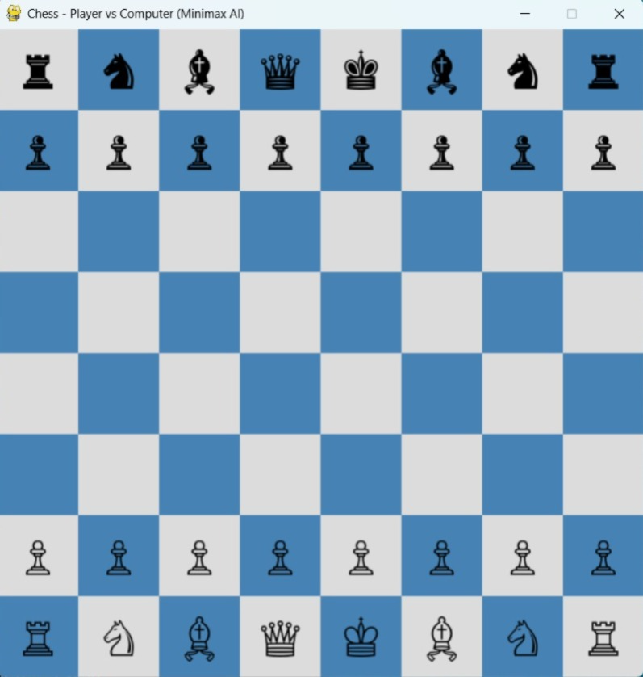
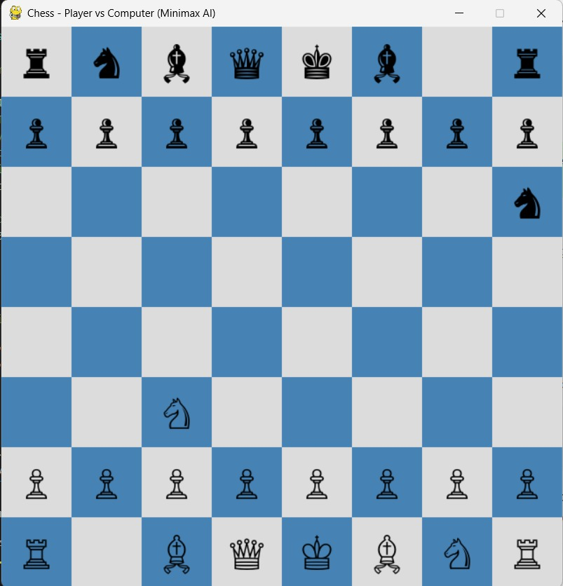

Chess - player vs Computer (Minimax Ai)

Gameplay for the Ai chess application found in chess.py

*How to run the file:*

1.Save the code: Ensure the provided PYTHON cod is saved as chess.py within the appropriate dictionary(i.e.AI-Games).

2\. Open the terminal/Command Prompt: Navigate to the dictionary containing chess.py .

3\. Execute: Run the script using your PYTHON interpreter.

*Required Software/Library/Framework:*

the game requires python 3.x  and 2 essential third-party libraries. You must install all them using pip before running the file:

1.Pygame: Used for the graphic interface (window, board, piece drawing and mouse input).

2.Python-chess: A powerful library used for all chess rules, move validation, board state management and standard chess logic.

*How to play the game:*

1\. Launch the Game

- Run the Python script in an environment where pygame and python-chess are installed.

-A window titled "Chess - Player vs Computer (Minimax AI)" will open with an 8×8 chessboard.

2\. Player Turn (White)

-You play as White.

-Use your mouse to interact:

>Click on a white piece to select it.

>Legal moves for that piece will be shown as green dots.

>Click on a destination square to move the piece.

>If the move is legal, it will be executed.

>If you move a pawn to the last rank (promotion), it will auto-promote to a Queen (or another piece if legal).

3\. Computer Turn (Black)

-After your move, the AI (Black) will automatically calculate and play its move using Minimax with depth 2.

-There's a short delay (pygame.time.wait(300)) before the AI moves.

4\. Game End Conditions

The game ends when:

1.Checkmate: One side wins.

2.Stalemate: No legal moves, but not in check.

3.Insufficient Material: Not enough pieces to checkmate.

4.75-move Rule or Fivefold Repetition: Draw conditions.

When the game ends:

-A message like "Player Wins!", "Computer Wins!", or "Draw" will be displayed for 4 seconds.

5\. Exit the Game

-Close the window or click the red X to quit.

-The game will shut down cleanly with pygame.quit() and sys.exit().

*Screenshots are:*

