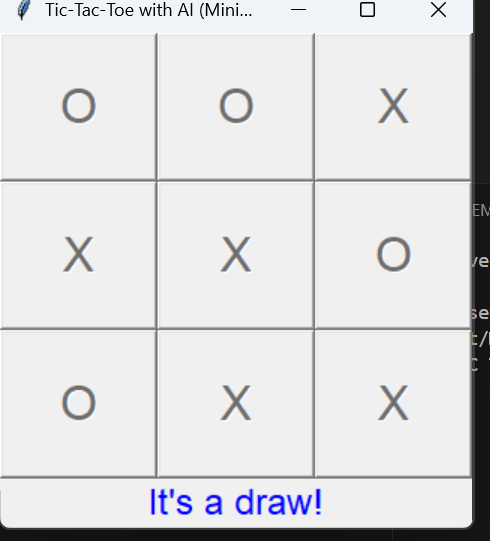
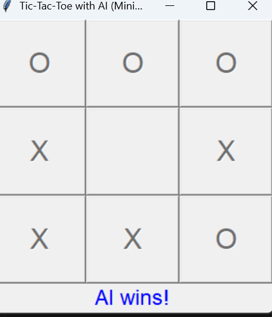

\# Tic-Tac-Toe with AI (Minimax)


This is a GUI-based Tic-Tac-Toe game built using Python and Tkinter. You play as \*\*X\*\*, and the AI plays as \*\*O\*\*, using the \*\*Minimax algorithm\*\* to make optimal moves.


\## How to Run the Game


1\. Make sure you have \*\*Python 3.x\*\* installed.

2\. Tkinter is included with most Python installations. If not, install it:

&nbsp;  ```bash

&nbsp;  pip install tk

3.Run the game:

python tic\_tac\_toe.py


*## How to Play:*


-You play as X.


-Click on any empty cell to make your move.


-The AI will respond automatically.


-The game ends when either player wins or the board is full (draw).


*##Algorithm Used:*


-Minimax Algorithm: A recursive decision-making algorithm used in two-player games to simulate all possible moves and choose the optimal one.


*## Dependencies:*


-Python 3.x


-Tkinter (standard GUI library in Python)


*##Screenshots:*
1.
2.

