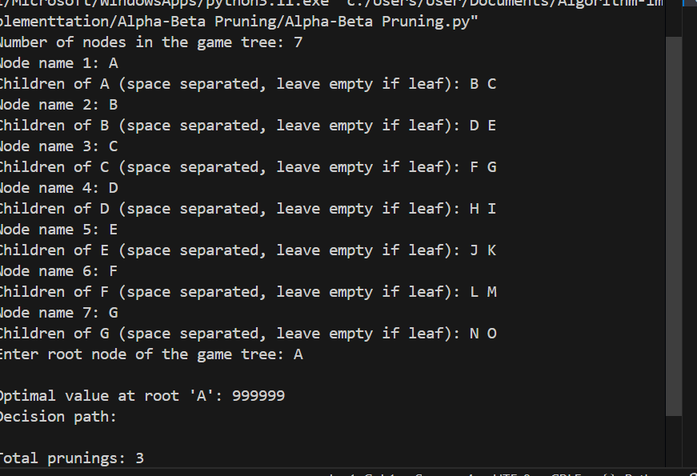

**Alpha-Beta Pruning**

How the Algorithm Works:

Alpha-Beta Pruning is an optimization technique for the Minimax algorithm, commonly used in decision-making and game theory. It reduces the number of nodes evaluated in the search tree by eliminating branches that cannot possibly influence the final decision.

Key Concepts:

Alpha: The best value that the maximizer currently can guarantee.

Beta: The best value that the minimizer currently can guarantee.

During traversal, if the current node’s value is worse than the previously explored options, the algorithm prunes (ignores) that branch.

This avoids unnecessary computation and speeds up decision-making.

Example:

In a two-player game like Tic-Tac-Toe or Chess, Alpha-Beta Pruning helps the AI skip evaluating moves that won’t affect the outcome, making it faster without sacrificing optimality.

Applications of Alpha-Beta Pruning:

1.Game AI:

Chess

Tic-Tac-Toe

Connect Four

Checkers

2.Decision-making systems:

Strategic planning

Turn-based simulations

3.AI agents:

Bots in competitive environments

Real-time strategy games

Time and Space Complexity:

Scenario	Complexity

Best Case	O(b^(d/2)) — where b is branching factor, d is depth

Worst Case	O(b^d) — same as Minimax

Space O(d) —  for depth-first traversal

