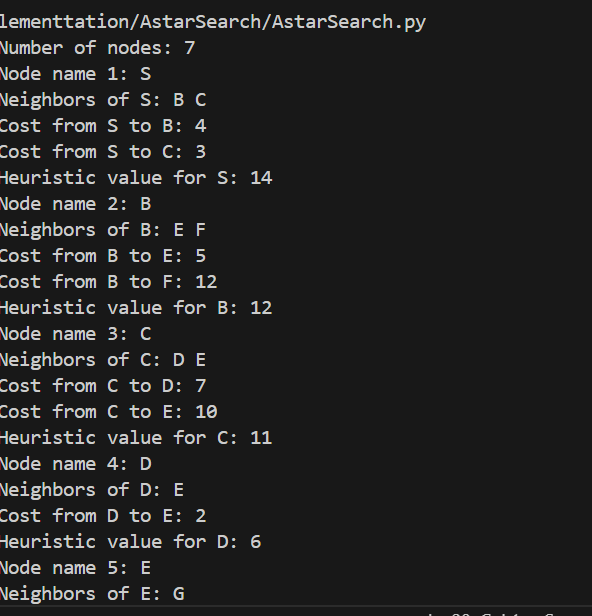
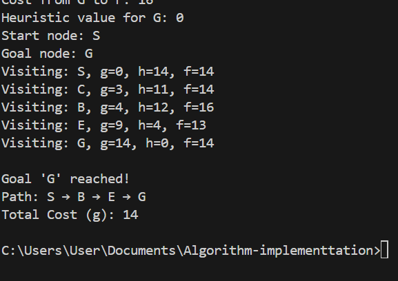

**A\* Search Algorithm:**

*How the Algorithm Works:*

A\* (A-Star) Search is a best-first search algorithm that finds the shortest path from a start node to a goal node in a weighted graph. It combines the strengths of Dijkstra’s Algorithm and Greedy Best-First Search by using both actual cost and estimated cost to guide its search.

*Core Formula:*

𝑓(𝑛) = 𝑔(𝑛) +ℎ(𝑛)

𝑔(𝑛) : Actual cost from the start node to node n.

ℎ(𝑛): Heuristic estimate of the cost from node 𝑛 to the goal.

𝑓(𝑛): Total estimated cost of the cheapest solution through node 𝑛.

A\* maintains a priority queue (often called the open list) and expands nodes with the lowest 

𝑓(𝑛). It guarantees the shortest path if the heuristic ℎ(𝑛)is admissible (never overestimates the cost).

*Applications of A\* Search*:

1.Pathfinding in games:

-Grid-based movement (e.g., maze solving, RTS games)

-NPC navigation

2.Robotics:

-Obstacle avoidance and route planning

3.Navigation systems:

-GPS route optimization

4.AI planning:

-Task scheduling and decision-making

5.Puzzle solving:

-Sliding puzzles (e.g., 8-puzzle, 15-puzzle)

*Time and Space Complexity:*

Scenario	Complexity

Time	        O(b^d)—where b is branching factor, d is depth of solution.

Space	        O(b^d) — stores all generated nodes.

Best Case	Much faster than BFS/Dijkstra with a good heuristic.

Worst Case	Similar to BFS if heuristic is poor or zero.

A\* is complete and optimal when using an admissible and consistent heuristic.

