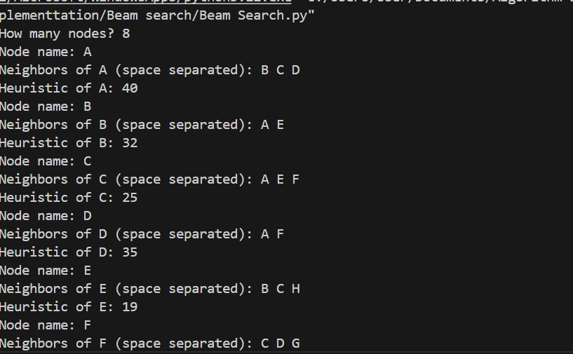
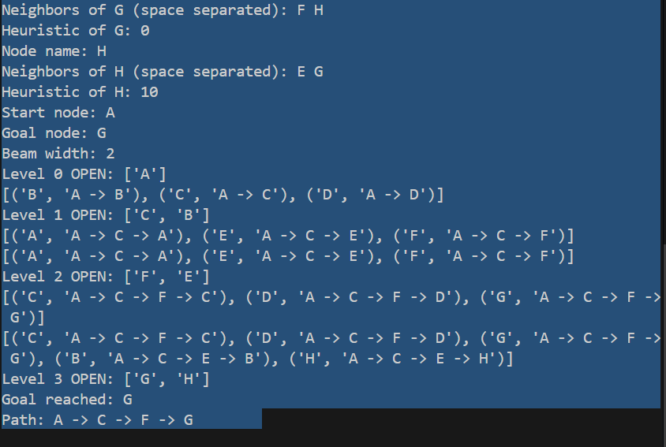

**Beam Search Algorithm**

How the Algorithm Works:

Beam Search is a heuristic search algorithm that explores a graph by expanding only the most promising nodes at each level, based on a heuristic evaluation function. It is a variant of Best-First Search, but with a key difference: instead of keeping all nodes in memory, it retains only a fixed number of the best candidates — called the beam width.

Key Steps:

1.Start from the initial node.

2.At each level, generate all possible successors of the current nodes.

3.Evaluate each successor using a heuristic function.

4.Select the top-k nodes (where k is the beam width) with the best scores.

5.Repeat the process until a goal state is found or the search space is exhausted.

Beam Search trades off optimality for efficiency, making it faster and more memory-efficient than exhaustive methods like A\* or BFS.

Applications of Beam Search:

1.Natural Language Processing (NLP):

2.Machine translation (e.g., Google Translate)

3.Text generation (e.g., GPT decoding)

4.Speech recognition

Game AI:

1.Move prediction in games like Chess or Go

2.Pathfinding:

3.Robotics and navigation systems

4.Optimization problems:

5.Scheduling, planning, and decision-making tasks

Time and Space Complexity:

Metric	        Complexity

Time	        O(b × d × log b) — where b is beam width, d is depth

Space	        O(b × d)

Best Case	Faster than BFS/A\* when beam width is small

Worst Case	May miss optimal solution if beam width is too narrow

Beam Search is not complete and not optimal, but it is highly efficient for large search spaces when approximate solutions are acceptable.

