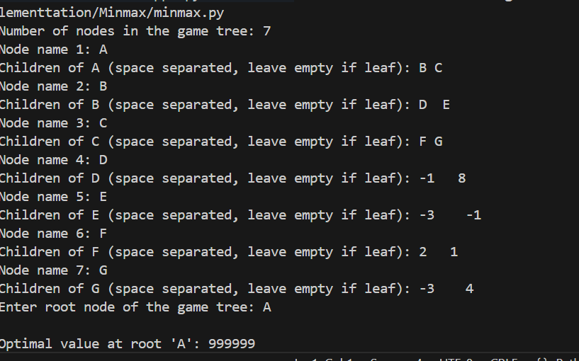

**Minimax Algorithm**

*How the Algorithm Works:*

Minimax is a recursive decision-making algorithm used in two-player, turn-based games. It assumes both players play optimally and aims to minimize the possible loss for a worst-case scenario. The algorithm evaluates the game tree by simulating all possible moves and counter-moves, assigning scores to terminal states, and propagating those scores back up the tree.

*Key Concepts:*

-Maximizing player: Tries to get the highest score.

-Minimizing player: Tries to reduce the maximizing player’s score.

-The algorithm alternates between these roles at each level of the tree.

-At each node, it chooses the move that leads to the best guaranteed outcome.

Minimax is often enhanced with Alpha-Beta Pruning to reduce the number of nodes evaluated.

*Applications of Minimax:*

1.Game AI:

-Tic-Tac-Toe

-Chess

-Connect Four

-Checkers

2.Decision-making systems:

-Strategic planning

-Turn-based simulations

3.AI agents:

-Bots in competitive environments

4.Economic modeling:

-Competitive market simulations.

*Time and Space Complexity:*

Scenario	Complexity

Time	        O(b^d) — where b is branching factor, d is depth of the game tree.

Space	        O(d) — for recursive stack in depth-first traversal.

Best Case	Efficient with pruning or shallow depth.

Worst Case	Exponential growth in deep trees without pruning.

Minimax is complete and optimal for zero-sum games with perfect information, but can be computationally expensive for complex games.

