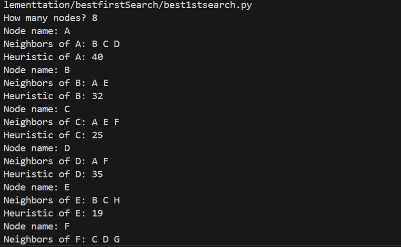
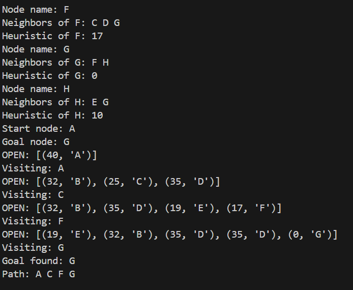

**Best-First Search Algorithm**

*How the Algorithm Works:*

Best-First Search is an informed search algorithm that uses a heuristic function to guide its traversal through a graph or search space. It selects the most promising node based on the lowest heuristic cost and expands it first. The algorithm maintains a priority queue where nodes are sorted by their heuristic value.

*Key Steps:*

Start from the initial node.

Evaluate all neighboring nodes using a heuristic function ℎ(𝑛)

Select the node with the lowest heuristic value.

Repeat the process until the goal node is reached.

Unlike A\*, Best-First Search does not consider the cost from the start node — it only uses the estimated cost to the goal, which can lead to faster but non-optimal paths.

*Applications of Best-First Search:*

1.Pathfinding in AI and games:

-Maze solving

-NPC movement

2.Robotics:

-Navigation and obstacle avoidance

3.Web crawling:

-Prioritizing pages based on relevance

4.Decision-making systems:

-Planning and scheduling

5.Puzzle solving:

-Finding approximate solutions quickly

*Time and Space Complexity:*

Scenario	Complexity

Time	        O(b^d) — where b is branching factor, d is depth.

Space	        O(b^d) — stores all generated nodes.

Best Case	Fast with a good heuristic.

Worst Case	May explore many irrelevant paths if heuristic is poor.

Best-First Search is not guaranteed to find the shortest path, but it is efficient for large spaces when speed is prioritized over optimality.

