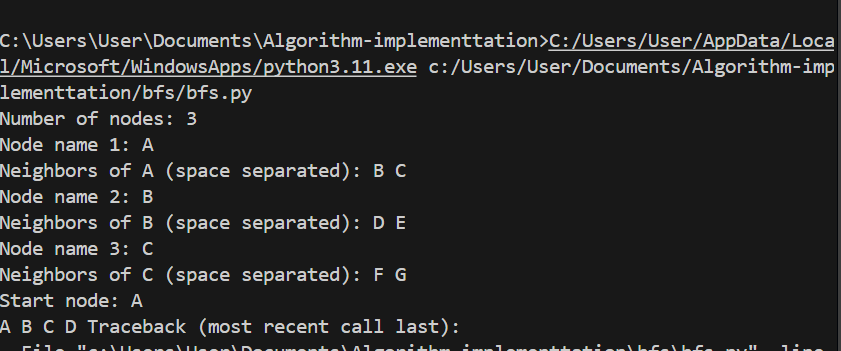

**Breadth-First Search (BFS)**

*How the Algorithm Works:*

Breadth-First Search (BFS) is a graph traversal algorithm that explores all nodes at the current depth before moving to the next level. It uses a queue data structure to keep track of nodes to visit, ensuring that the closest nodes are explored first.

*Key Steps:*

1.Start from the initial node and enqueue it.

2.Mark the node as visited.

3.While the queue is not empty:

-Dequeue the front node.

-Visit all its unvisited neighbors.

-Enqueue each neighbor and mark it as visited.

4.Repeat until all reachable nodes are visited or the goal is found.

BFS guarantees the shortest path in an unweighted graph.

*Applications of BFS:*

<b>Shortest path finding</b> in unweighted graphs.

**Social networks**: Finding degrees of separation.

**Web crawlers:** Exploring links layer by layer.

**AI and games:** Puzzle solving (e.g., 8-puzzle).

**Network broadcasting:** Flooding algorithms.

**Connected components**: Identifying clusters in graphs.

**Time and Space Complexity:**

Scenario	  Complexity

Time	          O(V + E) — where V is vertices, E is edges.

Space	          O(V) — for visited list and queue.

Best Case	  Goal found early in shallow levels.

Worst Case	  Explores entire graph before finding goal.

BFS is complete and optimal for unweighted graphs, but can be memory-intensive for large graphs.

