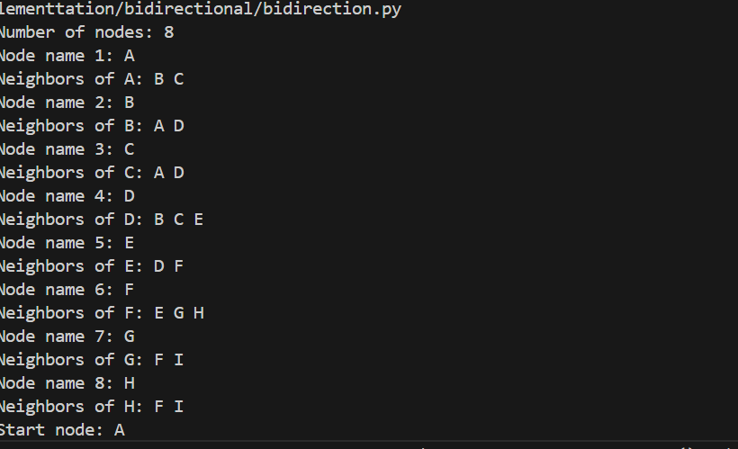

**Bidirectional Search**

*How the Algorithm Works:*

Bidirectional Search is a graph traversal algorithm that searches simultaneously from both the start node and the goal node, meeting somewhere in the middle. This approach significantly reduces the search space compared to traditional unidirectional searches like BFS or DFS.

*Key Steps:*

1.Initialize two frontiers: one from the start node and one from the goal node.

2.Expand nodes alternately from both directions.

3.Track visited nodes from both searches.

4.When a node is found that exists in both frontiers, the path is reconstructed by combining the two halves.

This method is most effective when the start and goal nodes are known and the search space is symmetric.

*Applications of Bidirectional Search:*

1.Pathfinding in large graphs:

-Maps and navigation systems

-Maze solving.

2.AI in games:

-Finding shortest paths between two characters or objects.

3.Social networks:

-Finding shortest connection paths between two users.

4.Robotics:

-Efficient route planning between two points.

*Time and Space Complexity:*

Scenario	Complexity

Time	        O(b^(d/2))—where b is branching factor,d is depth of      solution.

Space	        O(b^(d/2)) — stores nodes from both directions.

Best Case	Much faster than BFS or DFS in large graphs.

Worst Case	Similar to BFS if no overlap is found early.

Bidirectional Search is complete and can be optimal if both searches use BFS in an unweighted graph.

