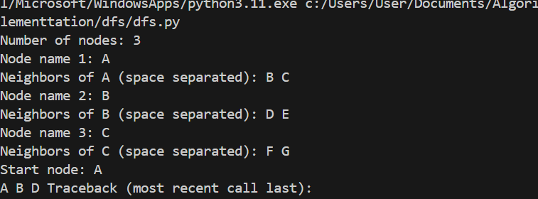

**Depth-First Search (DFS)**

*How the Algorithm Works:*

Depth-First Search (DFS) is a graph traversal algorithm that explores as far as possible along each branch before backtracking. It uses a stack (either explicitly or via recursion) to keep track of nodes to visit.

*Key Steps:*

1.Start from the initial node.

2.Visit the node and mark it as visited.

3.Recursively (or iteratively) visit each unvisited neighbor.

4.Backtrack when no unvisited neighbors remain.

5.Repeat until all reachable nodes are visited or the goal is found.

DFS explores depth before breadth, making it suitable for problems where solutions are deep in the search tree.

*Applications of DFS:*

**Pathfinding** in mazes and graphs

**Cycle detection** in graphs

**Topological sorting** in directed acyclic graphs (DAGs)

**Solving puzzles** like Sudoku or N-Queens

**Connected components** in undirected graphs

**Maze generation** algorithms

**AI planning** and decision trees

*Time and Space Complexity:*

Scenario	Complexity

Time	        O(V + E) — where V is vertices, E is edges.

Space	        O(V) — for visited list and recursion stack.

Best Case	Goal found early in deep branch.

Worst Case	Explores entire graph before finding goal.

DFS is not guaranteed to find the shortest path, but it is efficient for deep or tree-like structures.

