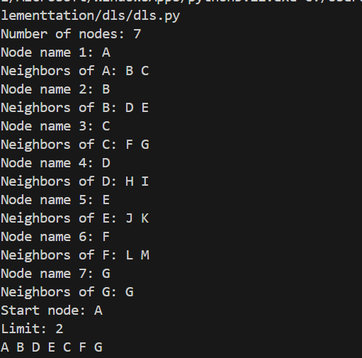

**Depth-Limited Search (DLS)**

*How the Algorithm Works:*

Depth-Limited Search (DLS) is a variant of Depth-First Search (DFS) that imposes a limit on the depth of the search tree. It explores nodes up to a specified depth and does not go beyond that limit, which helps prevent infinite loops in cyclic or infinite graphs.

Key Steps:

1.Start from the initial node.

2.Recursively explore each branch up to a maximum depth limit.

3.If the depth limit is reached, stop expanding that branch.

4.Continue exploring other branches within the limit.

5.Return success if the goal is found within the depth; otherwise, failure.

DLS is useful when the depth of the solution is known or when you want to avoid deep, potentially infinite paths.

*Applications of DLS:*

<b>Game tree exploration</b> with known depth.

**AI planning** with bounded steps.

**Solving puzzles** where solution depth is predictable.

**Avoiding infinite loops** in cyclic graphs.

**Precursor to Iterative Deepening Search (IDS).**

*Time and Space Complexity:*

Scenario	Complexity

Time	        O(b^l) — where b is branching factor, l is depth limit.

Space	        O(l) — due to recursion stack.

Best Case	Goal found early within depth limit.

Worst Case	Goal beyond depth limit → incomplete search.

DLS is not complete if the depth limit is too small, and not optimal unless the goal is at the shallowest depth.

