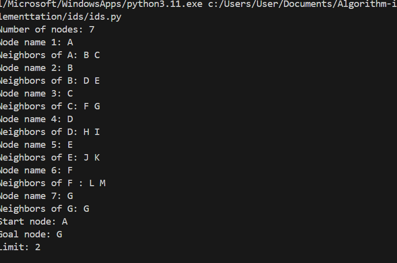
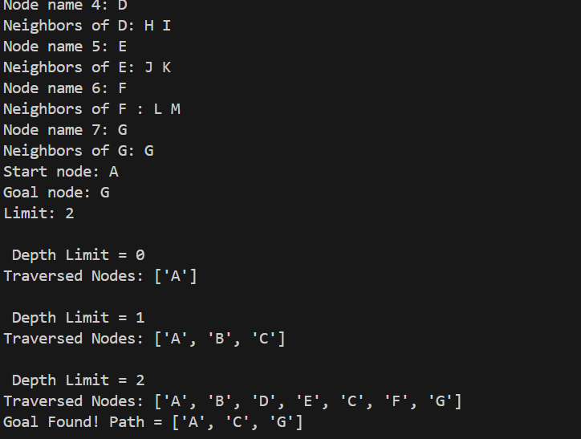

**🔁 Iterative Deepening Search (IDS)**

*How the Algorithm Works:*

Iterative Deepening Search (IDS) is a hybrid search algorithm that combines the space efficiency of Depth-First Search (DFS) with the completeness of Breadth-First Search (BFS). It performs a series of Depth-Limited Searches (DLS) with increasing depth limits until the goal is found.

*Key Steps:*

1.Set an initial depth limit (e.g., 0).

2.Perform Depth-Limited Search up to that limit.

3.If the goal is not found, increment the depth limit and repeat.

4.Continue until the goal is found or the search space is exhausted.

IDS re-explores nodes multiple times but ensures that the shallowest solution is found first, making it complete and optimal for uniform-cost problems.

*Applications of IDS*

1.Game tree exploration:

-Chess, Checkers, and other turn-based games.

2.AI planning:

-When solution depth is unknown.

3.Robotics and navigation:

-Pathfinding in large or infinite graphs.

4.Puzzle solving:

-8-puzzle, 15-puzzle, and similar problems.

5.Search in memory-constrained environments.

*Time and Space Complexity:*

Scenario	Complexity

Time	        O(b^d) — where b is branching factor, d is depth of solution.

Space	        O(d) — uses DFS stack, not full tree.

Best Case	Goal found in early iterations.

Worst Case	Repeated exploration increases overhead, but still better than BFS in space.

IDS is complete, optimal for uniform-cost problems, and space-efficient, making it ideal for deep search spaces.

